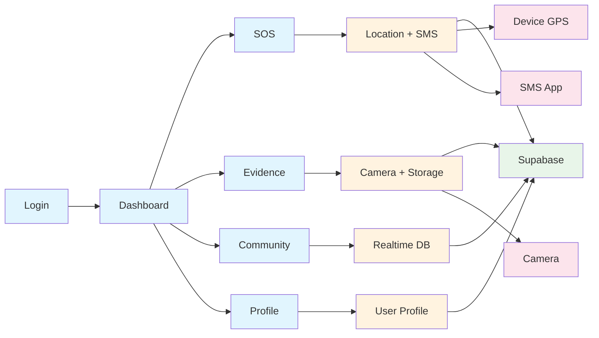

# SAFRA App Dataflow Diagram

## Overview
SAFRA is a safety app with emergency SOS, evidence upload, and community reporting features. Built with Flutter + Supabase.

## Simple Architecture

```
📱 Flutter App → 🔧 Services → ☁️ Supabase Backend
```

## Key Features Flow

### 1. User Login
```
Login Screen → Auth Service → Supabase Auth → Dashboard
```

### 2. Emergency SOS
```
SOS Button → Get Location → Send SMS → Alert Contacts
```

### 3. Upload Evidence
```
Take Photo → Add Location → Upload → Save to Database
```

### 4. Community Reports
```
Post Report → Real-time Update → Show to All Users
```

## Dataflow Diagram



## What Each Part Does

### 📱 Screens (User Interface)
- **Login**: User authentication
- **Dashboard**: Main menu with all features
- **SOS**: Emergency location sharing
- **Evidence**: Upload photos/videos with location
- **Community**: Real-time incident reports
- **Profile**: User settings and info

### 🔧 Services (App Logic)
- **Auth Service**: Handles login/signup
- **Location Service**: Gets GPS coordinates
- **SMS Service**: Shares location via text
- **Storage Service**: Uploads files to cloud
- **Profile Service**: Manages user data

### ☁️ Supabase (Backend)
- **Auth**: User authentication
- **Database**: Stores user profiles, evidence, reports
- **Storage**: Saves photos and videos
- **Realtime**: Live community updates

### 📡 Device Services
- **GPS**: Provides location coordinates
- **Camera**: Takes photos/videos
- **SMS**: Sends emergency messages

## Data Types

### User Profile
```
Name, Phone, Photo, Emergency Contact
```

### Evidence
```
Photos/Videos + Location + Category + Notes
```

### Community Report
```
Message + Location + Severity + Timestamp
```

## Security
- OAuth login (Google/Apple)
- Location only shared with consent
- Anonymous posting available
- Encrypted data transmission

## Quick Flow Summary

1. **Login**: User → Auth → Supabase → Dashboard
2. **SOS**: Dashboard → Location → SMS → Emergency contacts
3. **Evidence**: Dashboard → Camera → Upload → Database
4. **Community**: Dashboard → Post → Realtime → All users see it

That's it! Simple, clear data flow for safety features.